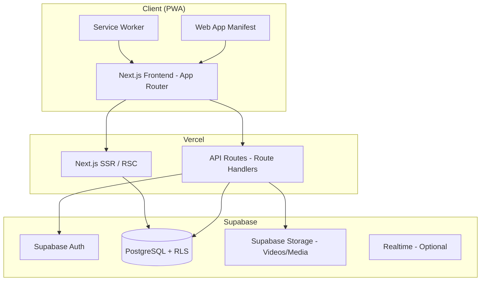
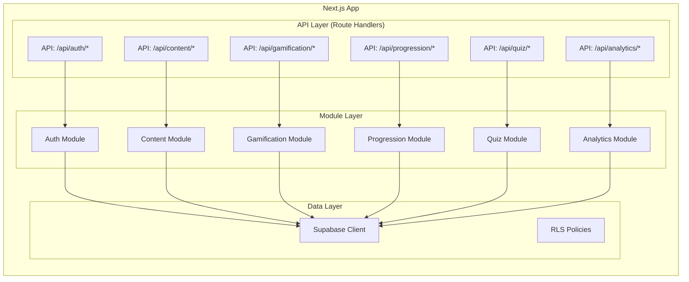
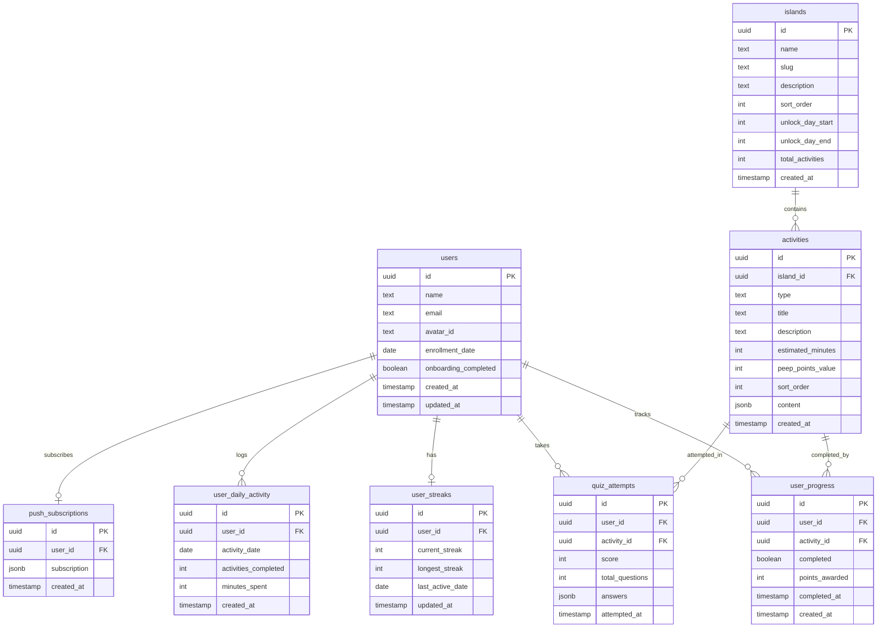

# Design Document: GAMER-ICU PWA Architecture & Development Plan

## Overview

GAMER-ICU is a gamified PWA for pediatric ICU nurses to learn invasive mechanical ventilation over a 90-day curriculum. The app is built with Next.js (App Router) deployed on Vercel, using Supabase for database, authentication, and file storage. The backend follows a modular monolith pattern where each domain (auth, content, gamification, progression, quiz, analytics) is a self-contained module with clear interfaces. The frontend is a mobile-first PWA with a sci-fi themed planet map, activity renderers for 6 content types, and a gamification HUD. Two developers work in parallel: Kien on backend/architecture/deployment and Jenifer on frontend/design/media.

## Architecture

### High-Level Architecture



### Modular Monolith Structure



### Technology Stack

| Layer | Technology | Rationale |
|-------|-----------|-----------|
| Framework | Next.js 14+ (App Router) | SSR, RSC, API routes, file-based routing |
| Hosting | Vercel | Native Next.js support, preview deploys, edge functions |
| Database | Supabase (PostgreSQL) | Managed Postgres, RLS for HIPAA, real-time subscriptions |
| Auth | Supabase Auth | Email/password, JWT sessions, RLS integration |
| Storage | Supabase Storage | Video/media hosting with signed URLs |
| Styling | Tailwind CSS | Utility-first, mobile-responsive, fast iteration |
| Animation | Framer Motion | Star Wars intro, map transitions, activity animations |
| State Management | Zustand or React Context | Lightweight client state for gamification HUD |
| PWA | next-pwa / Serwist | Service worker generation, manifest, caching |
| Push Notifications | Web Push API + Supabase Edge Functions | Streak reminders, island unlock alerts |
| Testing | Vitest + fast-check | Unit tests + property-based testing |
| Quiz Interactions | dnd-kit | Drag and drop, matching quiz types |
| Linting | ESLint + Prettier | Code consistency |
| Type Safety | TypeScript | End-to-end type safety |

### Directory Structure

```
src/
├── app/                          # Next.js App Router
│   ├── (auth)/                   # Auth route group
│   │   ├── login/page.tsx
│   │   ├── register/page.tsx
│   │   └── onboarding/page.tsx
│   ├── (main)/                   # Authenticated route group
│   │   ├── dashboard/page.tsx
│   │   ├── island/[id]/page.tsx
│   │   ├── activity/[id]/page.tsx
│   │   └── researcher/page.tsx
│   ├── api/                      # API Route Handlers
│   │   ├── auth/
│   │   ├── content/
│   │   ├── gamification/
│   │   ├── progression/
│   │   ├── quiz/
│   │   └── analytics/
│   ├── layout.tsx
│   └── manifest.ts               # PWA manifest
├── modules/                      # Backend module logic
│   ├── auth/
│   │   ├── service.ts
│   │   ├── types.ts
│   │   └── index.ts
│   ├── content/
│   │   ├── service.ts
│   │   ├── schemas.ts            # JSON schemas per activity type
│   │   ├── types.ts
│   │   └── index.ts
│   ├── gamification/
│   │   ├── service.ts
│   │   ├── types.ts
│   │   └── index.ts
│   ├── progression/
│   │   ├── service.ts
│   │   ├── types.ts
│   │   └── index.ts
│   ├── quiz/
│   │   ├── service.ts
│   │   ├── randomizer.ts
│   │   ├── types.ts
│   │   └── index.ts
│   └── analytics/
│       ├── service.ts
│       ├── types.ts
│       └── index.ts
├── components/                   # Shared UI components
│   ├── map/                      # Planet map components
│   ├── activities/               # Activity type renderers
│   │   ├── VideoPlayer.tsx
│   │   ├── ReadingView.tsx
│   │   ├── QuizRenderer.tsx
│   │   ├── CaseVignette.tsx
│   │   ├── QuestValidator.tsx
│   │   └── VentLabSim.tsx
│   ├── gamification/             # HUD, streak, points display
│   ├── onboarding/               # Star Wars intro, avatar picker
│   └── ui/                       # Shared primitives (buttons, cards, etc.)
├── lib/                          # Shared utilities
│   ├── supabase/
│   │   ├── client.ts             # Browser client
│   │   ├── server.ts             # Server client
│   │   └── middleware.ts         # Auth middleware
│   ├── push-notifications.ts
│   └── utils.ts
├── hooks/                        # Custom React hooks
└── types/                        # Shared TypeScript types
```

## Components and Interfaces

### 1. Authentication Module

**Responsibility:** User registration, login, session management, and onboarding flow.

**Interface:**
```typescript
// modules/auth/types.ts
interface AuthService {
  register(name: string, email: string, password: string): Promise<User>
  login(email: string, password: string): Promise<Session>
  logout(): Promise<void>
  getCurrentUser(): Promise<User | null>
  updateAvatar(userId: string, avatarId: string): Promise<void>
  completeOnboarding(userId: string): Promise<void>
}

interface User {
  id: string
  name: string
  email: string
  avatarId: string
  enrollmentDate: Date
  onboardingCompleted: boolean
  createdAt: Date
}
```

### 2. Content Module

**Responsibility:** CRUD operations for activity content, content schema validation, media URL management.

**Interface:**
```typescript
// modules/content/types.ts
interface ContentService {
  getIslandActivities(islandId: string): Promise<Activity[]>
  getActivity(activityId: string): Promise<Activity>
  getVideoUrl(storageKey: string): Promise<string>  // signed URL
}

type ActivityType = 'video' | 'reading' | 'quiz' | 'case_vignette' | 'quest' | 'vent_lab'

interface Activity {
  id: string
  islandId: string
  type: ActivityType
  title: string
  description: string
  estimatedMinutes: number
  peepPointsValue: number
  sortOrder: number
  content: VideoContent | ReadingContent | QuizContent | CaseContent | QuestContent | VentLabContent
}

interface VideoContent {
  storageKey: string
  durationSeconds: number
}

interface ReadingContent {
  body: string          // markdown or rich text
  confirmationQuestion: {
    question: string
    correctAnswer: string
    options: string[]
  }
}
```

### 3. Gamification Module

**Responsibility:** PEEP Points awarding, streak tracking, duplicate completion prevention.

**Interface:**
```typescript
// modules/gamification/types.ts
interface GamificationService {
  awardPoints(userId: string, activityId: string): Promise<PointsResult>
  getStreak(userId: string): Promise<StreakInfo>
  updateStreak(userId: string): Promise<StreakInfo>
  getTotalPoints(userId: string): Promise<number>
}

interface PointsResult {
  awarded: boolean       // false if already completed
  pointsAwarded: number
  totalPoints: number
}

interface StreakInfo {
  currentStreak: number
  longestStreak: number
  lastActiveDate: Date
  streakBonusEarned: boolean
}
```

### 4. Progression Module

**Responsibility:** Island unlock logic, completion percentage tracking, final exam gating, binge prevention.

**Interface:**
```typescript
// modules/progression/types.ts
interface ProgressionService {
  getUnlockedIslands(userId: string): Promise<IslandStatus[]>
  getIslandProgress(userId: string, islandId: string): Promise<IslandProgress>
  isFinalExamUnlocked(userId: string, islandId: string): Promise<boolean>
  canAccessContent(userId: string): Promise<boolean>  // binge prevention check
  markActivityComplete(userId: string, activityId: string): Promise<void>
}

interface IslandStatus {
  islandId: string
  name: string
  unlocked: boolean
  unlockDay: number
  completionPercentage: number
  finalExamUnlocked: boolean
}

interface IslandProgress {
  totalActivities: number
  completedActivities: number
  completionPercentage: number
  finalExamUnlocked: boolean
}
```

### 5. Quiz Module

**Responsibility:** Quiz rendering data, question/option randomization, answer validation, score tracking.

**Interface:**
```typescript
// modules/quiz/types.ts
interface QuizService {
  getQuiz(activityId: string): Promise<RandomizedQuiz>
  submitAnswer(userId: string, questionId: string, answer: QuizAnswer): Promise<AnswerResult>
  submitQuiz(userId: string, activityId: string, answers: QuizAnswer[]): Promise<QuizResult>
}

type QuestionType = 'mcq' | 'drag_drop' | 'matching' | 'fill_blank'

interface QuizQuestion {
  id: string
  type: QuestionType
  prompt: string
  options: string[]
  correctAnswer: string | string[]  // string for MCQ/fill, string[] for matching/drag
  imageUrl?: string
}

interface RandomizedQuiz {
  activityId: string
  questions: QuizQuestion[]  // randomized order, randomized options
}

interface QuizResult {
  score: number
  totalQuestions: number
  pointsEarned: number
}
```

### 6. Analytics Module

**Responsibility:** Aggregate metrics for researcher view, anonymized data export.

**Interface:**
```typescript
// modules/analytics/types.ts
interface AnalyticsService {
  getAggregateMetrics(): Promise<AggregateMetrics>
  getUserMetrics(userId: string): Promise<UserMetrics>  // admin only
  exportData(format: 'csv' | 'json'): Promise<Blob>
}

interface AggregateMetrics {
  totalUsers: number
  averagePeepPoints: number
  averageStreak: number
  completionRatesByIsland: Record<string, number>
  averageTimeSpent: number
}

interface UserMetrics {
  anonymizedId: string
  totalPeepPoints: number
  longestStreak: number
  totalTimeMinutes: number
  completionPercentageByIsland: Record<string, number>
}
```

### Frontend Components

| Component | Description | Props/Data |
|-----------|-------------|------------|
| `PlanetMap` | Interactive SVG/canvas map with 6 islands | `islands: IslandStatus[]` |
| `IslandNode` | Single island on map (active/greyed) | `status: IslandStatus` |
| `GamificationHUD` | Top bar with avatar, streak, PEEP points | `user: User, streak: StreakInfo, points: number` |
| `StarWarsIntro` | Scrolling text animation for onboarding | `narrativeText: string` |
| `AvatarPicker` | Grid of selectable avatar icons | `onSelect: (id: string) => void` |
| `ActivityList` | List of activities within an island | `activities: Activity[]` |
| `VideoPlayer` | Video playback with completion tracking | `content: VideoContent` |
| `ReadingView` | Text/graphic display + confirmation question | `content: ReadingContent` |
| `QuizRenderer` | Renders MCQ, drag-drop, matching, fill-blank | `quiz: RandomizedQuiz` |
| `CaseVignette` | Clinical scenario with decision tree + SBAR | `content: CaseContent` |
| `QuestValidator` | Password input for real-life task validation | `content: QuestContent` |
| `VentLabSim` | Interactive ventilator simulation | `content: VentLabContent` |
| `ProgressBar` | Activity/island completion progress | `current: number, total: number` |
| `FeedbackButton` | Link to external Google Form | `formUrl: string` |

## Data Models

### Database Schema (Supabase PostgreSQL)



### Row Level Security (RLS) Policies

| Table | Policy | Rule |
|-------|--------|------|
| `users` | Users read own data | `auth.uid() = id` |
| `user_progress` | Users read/write own progress | `auth.uid() = user_id` |
| `user_streaks` | Users read/write own streaks | `auth.uid() = user_id` |
| `quiz_attempts` | Users read/write own attempts | `auth.uid() = user_id` |
| `islands` | All authenticated users can read | `auth.role() = 'authenticated'` |
| `activities` | All authenticated users can read | `auth.role() = 'authenticated'` |
| `user_daily_activity` | Users read/write own daily logs | `auth.uid() = user_id` |

### Content JSON Schemas (stored in `activities.content` JSONB column)

**Video:**
```json
{
  "storageKey": "videos/island-1/oxygenation-map.mp4",
  "durationSeconds": 600
}
```

**Reading/Graphic:**
```json
{
  "body": "## Airway Anatomy\n...",
  "confirmationQuestion": {
    "question": "What is the primary function of the alveoli?",
    "correctAnswer": "Gas exchange",
    "options": ["Gas exchange", "Air filtration", "Mucus production", "Sound production"]
  }
}
```

**Quiz:**
```json
{
  "questions": [
    {
      "id": "q1",
      "type": "mcq",
      "prompt": "Which parameter primarily affects oxygenation?",
      "options": ["FiO2", "Respiratory Rate", "Tidal Volume", "I:E Ratio"],
      "correctAnswer": "FiO2",
      "imageUrl": null
    }
  ]
}
```

**Quest:**
```json
{
  "instructions": "Ask your RT to supervise you performing in-line suctioning...",
  "validationPassword": "SUCTION2024",
  "supervisorRole": "Respiratory Therapist"
}
```


## Correctness Properties

*A property is a characteristic or behavior that should hold true across all valid executions of a system — essentially, a formal statement about what the system should do. Properties serve as the bridge between human-readable specifications and machine-verifiable correctness guarantees.*

The following properties are derived from the acceptance criteria in the requirements document. Each property is universally quantified and suitable for property-based testing.

### Authentication & Access Control

**Property 1: Invalid credentials are rejected with specific errors**
*For any* credential input that is invalid (missing name, malformed email, password too short, or wrong password), the Authentication_Module should return a rejection with a specific error message and never create a session.
**Validates: Requirements 1.4**

**Property 2: RLS data isolation**
*For any* two distinct users A and B, user A's authenticated session should only be able to read and write user A's rows in user_progress, user_streaks, quiz_attempts, and user_daily_activity — never user B's rows.
**Validates: Requirements 1.7**

### Dashboard & Island Display

**Property 3: Dashboard displays all user stats**
*For any* authenticated user with any combination of avatar, streak count, and PEEP_Points total, the Dashboard render should include the username, avatar, streak count, and total PEEP_Points.
**Validates: Requirements 2.2**

**Property 4: Island unlock status matches enrollment day**
*For any* enrollment day D (0 ≤ D ≤ 90), the set of unlocked islands should be: Islands 1–2 if D ≤ 30, Islands 1–4 if 31 ≤ D ≤ 60, Islands 1–6 if 61 ≤ D ≤ 90. Previously unlocked islands remain accessible regardless of current day.
**Validates: Requirements 2.3, 2.4, 2.6, 5.1, 5.2, 5.3**

### Content & Activities

**Property 5: Activity list completeness**
*For any* island, the activity list returned by the Island_Module should contain all activities for that island, each with a valid type, estimated time > 0, and PEEP_Points value ≥ 0.
**Validates: Requirements 3.1**

**Property 6: Correct renderer per activity type**
*For any* activity, the Content_Interface should load a renderer that matches the activity's type field (video → VideoPlayer, reading → ReadingView, quiz → QuizRenderer, case_vignette → CaseVignette, quest → QuestValidator, vent_lab → VentLabSim).
**Validates: Requirements 3.2**

**Property 7: Reading activities require confirmation**
*For any* reading/graphic activity, the Activity_Tracker should not mark it complete until the user answers the confirmation question.
**Validates: Requirements 3.5**

**Property 8: Quiz points proportional to correct answers**
*For any* quiz with N questions where the user answers K correctly, the points awarded should equal `floor(activity.peep_points_value * K / N)`.
**Validates: Requirements 3.6**

**Property 9: Quest password validation**
*For any* quest activity, submitting the correct supervisor password should mark the quest complete, and submitting any incorrect password should not mark it complete.
**Validates: Requirements 3.8**

**Property 10: Content schema validation**
*For any* activity content JSON stored in the database, it should validate against the JSON schema defined for its activity type.
**Validates: Requirements 7.5**

**Property 11: Missing content shows placeholder**
*For any* activity where the content field is null or fails schema validation, the Content_Interface should render a "coming soon" placeholder instead of crashing.
**Validates: Requirements 7.3**

### Gamification

**Property 12: First completion awards points**
*For any* user and any activity not previously completed by that user, completing the activity should increase the user's total PEEP_Points by exactly the activity's peep_points_value.
**Validates: Requirements 4.1**

**Property 13: Repeat completion is idempotent for points**
*For any* user and any activity previously completed by that user, redoing the activity should not change the user's total PEEP_Points.
**Validates: Requirements 4.2**

**Property 14: Streak bonus at 7 consecutive days**
*For any* user who has logged in on 7 consecutive days, the Gamification_Engine should award a streak bonus. The bonus should only be awarded once per 7-day cycle.
**Validates: Requirements 4.3**

**Property 15: Streak resets on missed day**
*For any* user whose last_active_date is more than 1 calendar day before the current date, the current_streak should be reset to 0 (or 1 if they log in today).
**Validates: Requirements 4.4**

**Property 16: Total points invariant**
*For any* user, the total PEEP_Points stored should equal the sum of all points_awarded values in that user's user_progress records plus any streak bonuses earned.
**Validates: Requirements 4.5**

### Progression

**Property 17: Final exam unlock threshold**
*For any* island and user, the final exam is unlocked if and only if the user's completion percentage for that island is ≥ 80%. Completion percentage = completed_activities / total_activities × 100.
**Validates: Requirements 5.4, 5.5**

**Property 18: Binge prevention cap**
*For any* user on any single calendar day, the number of activities that can be completed should not exceed the configured daily limit.
**Validates: Requirements 5.6**

### Quiz

**Property 19: Quiz randomization produces permutations**
*For any* quiz with more than 1 question, loading the quiz multiple times should produce at least 2 distinct orderings of questions (statistically, over 10+ loads). The set of questions and options should remain the same — only the order changes.
**Validates: Requirements 6.2**

**Property 20: Answer feedback correctness**
*For any* quiz question and any submitted answer, the feedback should indicate "correct" if and only if the answer matches the stored correctAnswer.
**Validates: Requirements 6.3**

**Property 21: Quiz attempt persistence (round-trip)**
*For any* quiz submission, the quiz attempt should be retrievable from the database with the same score, total_questions, and answers as submitted.
**Validates: Requirements 6.5**

### Researcher View

**Property 22: Researcher view access control**
*For any* non-admin user, attempting to access the Researcher View route should result in a 403 or redirect — never rendering the metrics page.
**Validates: Requirements 8.2**

**Property 23: No PII in researcher default view**
*For any* data rendered in the Researcher View default display, no user names or email addresses should appear. All user references should use anonymized identifiers.
**Validates: Requirements 8.4**

## Error Handling

| Scenario | Module | Handling Strategy |
|----------|--------|-------------------|
| Invalid login credentials | Auth | Return specific error message (wrong email, wrong password, account not found) |
| Expired session / JWT | Auth Middleware | Redirect to login page, preserve intended destination for post-login redirect |
| Missing activity content | Content | Render "Coming Soon" placeholder, log warning for admin |
| Invalid content JSON | Content | Fall back to placeholder, log schema validation error |
| Video load failure | Content | Show retry button with error message, fall back to text description if available |
| Quiz submission failure | Quiz | Preserve answers in local state, retry submission, show error toast |
| Incorrect quest password | Quest | Show "incorrect password" message, allow retry, no lockout |
| Duplicate point award attempt | Gamification | Silently ignore (idempotent), return current total |
| Supabase connection failure | Data Layer | Show offline banner, queue writes for retry when connection restores |
| Push notification permission denied | PWA | Gracefully degrade, show in-app notifications instead |
| RLS policy violation | Data Layer | Return 403, log security event |
| Daily activity limit reached | Progression | Show friendly message explaining binge prevention, suggest returning tomorrow |

## Testing Strategy

### Dual Testing Approach

The testing strategy uses both unit tests and property-based tests for comprehensive coverage.

**Unit Tests (Vitest):**
- Specific examples and edge cases for each module
- Integration tests for Supabase client operations
- Component rendering tests for activity renderers
- API route handler tests with mocked Supabase client

**Property-Based Tests (fast-check + Vitest):**
- Universal properties across all valid inputs
- Each property test runs a minimum of 100 iterations
- Each test is tagged with its design property reference

**Property-Based Testing Library:** `fast-check` (TypeScript/JavaScript PBT library)

**Test Tag Format:** `Feature: pwa-architecture-plan, Property {number}: {property_text}`

### Test Organization

```
__tests__/
├── modules/
│   ├── auth/
│   │   ├── auth.service.test.ts          # Unit tests
│   │   └── auth.properties.test.ts       # Property tests (Properties 1, 2)
│   ├── gamification/
│   │   ├── gamification.service.test.ts  # Unit tests
│   │   └── gamification.properties.test.ts # Property tests (Properties 12-16)
│   ├── progression/
│   │   ├── progression.service.test.ts   # Unit tests
│   │   └── progression.properties.test.ts # Property tests (Properties 4, 17, 18)
│   ├── quiz/
│   │   ├── quiz.service.test.ts          # Unit tests
│   │   └── quiz.properties.test.ts       # Property tests (Properties 19-21)
│   ├── content/
│   │   ├── content.service.test.ts       # Unit tests
│   │   └── content.properties.test.ts    # Property tests (Properties 5, 6, 7, 8, 9, 10, 11)
│   └── analytics/
│       ├── analytics.service.test.ts     # Unit tests
│       └── analytics.properties.test.ts  # Property tests (Properties 22, 23)
├── components/
│   ├── map/
│   ├── activities/
│   └── gamification/
└── integration/
    └── supabase.test.ts
```

### Key Testing Priorities

1. **Gamification Engine** — Points idempotency (Property 13) and total points invariant (Property 16) are critical to prevent point farming
2. **Progression Engine** — Island unlock logic (Property 4) and 80% threshold (Property 17) gate the entire curriculum flow
3. **Quiz Randomizer** — Randomization (Property 19) and answer correctness (Property 20) directly affect learning outcomes
4. **RLS Policies** — Data isolation (Property 2) is essential for HIPAA compliance
5. **Content Schema** — Schema validation (Property 10) and placeholder fallback (Property 11) ensure the shell-first approach works
